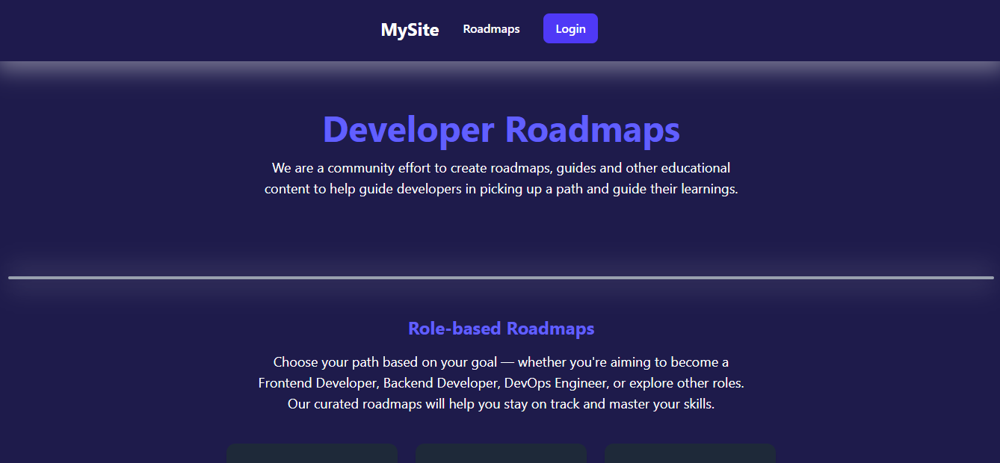

# project3-2025a-dante-francisco

# Projeto: 

Acesso: https://ashy-desert-085dc9f10.6.azurestaticapps.net/

#### Desenvolvedor(a)
Francisco Albrecht Ribas - Sistemas de informação

Dante Dardaque Santos - Sistemas de informação

#### Nosso Produto

##### Conteúdo:

##### Aparência:

##### Código: 

#### Desenvolvimento

#### Tecnologias
- React
- HTML e CSS
- Tailwind
- ASP.NET Core
- PostGres
- Azure

#### Ambiente de desenvolvimento
- VS Code + Extensions for React, React-Native and Redux in JS/TS and Live Server
- GitHub 

#### Referências e créditos
- ChatGPT
- [Microsoft learn ASP.NET webapi](https://learn.microsoft.com/en-us/aspnet/core/tutorials/first-web-api?view=aspnetcore-9.0&tabs=visual-studio)

---
Projeto entregue para a disciplina de [Desenvolvimento de Software para a Web](http://github.com/andreainfufsm/elc1090-2025a) em 2025a
